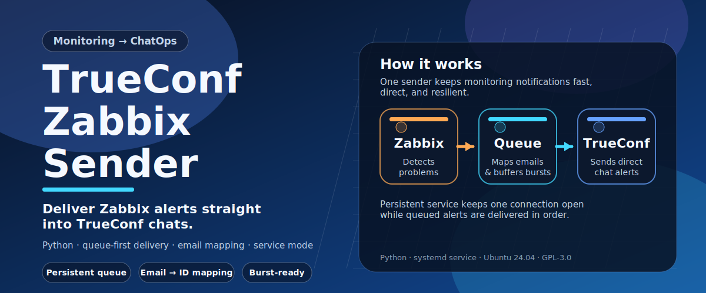

# TrueConf Zabbix Sender



A lightweight script that lets Zabbix send alert notifications as direct
TrueConf chat messages.

## How it works

### Service mode (recommended for production)

A systemd service (`trueconf-zabbix-sender`) keeps a single persistent
WebSocket connection to TrueConf Server. When Zabbix triggers an alert,
`send-trueconf-message.sh` converts the recipient emails to TrueConf IDs,
writes a small JSON task file to the `queue/` directory, and exits immediately
(exit 0). The running service picks it up within ~1 second and delivers the
message without reconnecting.

This design handles bursts of alerts natively. Recipients within the same
alert are delivered in parallel; multiple alerts are processed in arrival order.
If the service is temporarily down, task files accumulate in the queue and are
delivered automatically when the service comes back up.

### Direct mode (fallback)

When the `queue/` directory does not exist (service not installed),
`send-trueconf-message.sh` falls back to direct mode: it connects to TrueConf,
sends the message, and disconnects. This is fine for very infrequent alerts
(say, one every few days) but is not recommended for bursts.

### Email → TrueConf ID mapping

Email addresses from Zabbix (`user@example.com`) are automatically remapped
to TrueConf IDs (`user@tconf.example.com`) using the domain mapping in
`config.toml`. The mapping is case-insensitive; the username part is preserved.

## File overview

| File | Description |
|------|-------------|
| `trueconf_sender.py` | Main Python script (direct + service modes) |
| `config.toml` | Configuration — server, credentials, domain mapping |
| `send-trueconf-message.sh` | Shell wrapper called by Zabbix |
| `install.sh` | Automated installer for Ubuntu 22.04 / 24.04 |
| `uninstall.sh` | Removes all installed files, symlinks, and the service |
| `trueconf-zabbix-sender.service` | Optional systemd unit for service mode |

## Installation on Ubuntu 22.04 / 24.04 (Zabbix server)

Copy the entire project directory to the server and run:

```bash
sudo ./install.sh
```

With the optional persistent service:

```bash
sudo ./install.sh --install-service
```

The installer:
1. Checks Python ≥ 3.10
2. Installs `python3-venv` and `python3-pip`
3. Copies files to `/opt/trueconf-zabbix-sender/`
4. Creates a Python virtual environment and installs `python-trueconf-bot`;
   also installs the `tomli` backport automatically when Python 3.10 is detected
5. Creates a symlink in `/usr/lib/zabbix/alertscripts/`
6. Sets ownership to `zabbix:zabbix` with secure permissions

> **Ubuntu 22.04:** ships with Python 3.10 — no extra steps needed.
> **Ubuntu 24.04:** ships with Python 3.12 — no extra steps needed.
> **Other systems:** if Python 3.10+ is not the default `python3`, install it first
> (e.g. `sudo add-apt-repository ppa:deadsnakes/ppa && sudo apt install python3.10-venv`).

## Configuration

Edit `/opt/trueconf-zabbix-sender/config.toml`:

```toml
[server]
host       = "tconf.example.com"
port       = 443    # change if your server uses a non-standard HTTPS port
verify_ssl = true   # set false if the server uses a private/corporate CA cert

[credentials]
login    = "your_bot_account"
password = "your_password"

[email_mapping]
from_domain = "example.com"
to_domain   = "tconf.example.com"
```

### SSL certificate

#### Corporate / private CA

If the TrueConf server uses a self-signed or corporate CA certificate, install
the CA on Ubuntu and keep `verify_ssl = true`:

```bash
sudo cp corporate-ca.crt /usr/local/share/ca-certificates/
sudo update-ca-certificates
```

Then add the same cert to the Python bundle used by the sender:

```bash
cat corporate-ca.crt \
  >> /opt/trueconf-zabbix-sender/venv/lib/python3.*/site-packages/certifi/cacert.pem
```

> **Why both?** The system `update-ca-certificates` updates `/etc/ssl/certs/`,
> but the Python venv uses its own `certifi` CA bundle that is independent of
> the system store. Both must be updated.

#### Missing intermediate certificate (SSL verification failure on a public cert)

If authentication fails with
`certificate verify failed: unable to get local issuer certificate`
even though the TrueConf server has a certificate from a well-known CA
(e.g. GlobalSign), the server is likely **not sending the full certificate
chain** — only the leaf certificate, without its intermediate CA.

This is a misconfiguration on the TrueConf server side. The correct fix is to
configure the TrueConf server to include the full chain. Until that is done,
you can work around it on the Zabbix server by fetching the missing
intermediate and adding it to both trust stores.

First, find the intermediate cert URL from the leaf certificate's AIA field:

```bash
echo | timeout 10 openssl s_client -connect tconf.example.com:443 2>/dev/null \
  | openssl x509 -noout -text \
  | grep 'CA Issuers'
# Example output:
#   CA Issuers - URI:http://secure.globalsign.com/cacert/gsgccr6alphasslca2025.crt
```

Then download, convert, and install it:

```bash
# Download the intermediate (DER format) and convert to PEM
curl -sf http://secure.globalsign.com/cacert/gsgccr6alphasslca2025.crt \
  -o /tmp/intermediate.crt
openssl x509 -inform DER -in /tmp/intermediate.crt \
  -out /usr/local/share/ca-certificates/tconf-intermediate.crt

# Add to the system trust store
sudo update-ca-certificates

# Add to the Python venv's certifi bundle
cat /usr/local/share/ca-certificates/tconf-intermediate.crt \
  >> /opt/trueconf-zabbix-sender/venv/lib/python3.*/site-packages/certifi/cacert.pem
```

> **Note:** `pip install --upgrade certifi` will reset the certifi bundle and
> remove any manually appended certificates. Re-run the last `cat` command
> whenever the venv is recreated or certifi is upgraded.

## Manual testing

```bash
/opt/trueconf-zabbix-sender/send-trueconf-message.sh \
  "alice@example.com bob@example.com" \
  "Zabbix test message"
```

Exit codes: `0` success, `1` usage error, `2` config error, `3` delivery failure.

## Zabbix media type configuration

1. **Administration → Media types → Create media type**
   - Type: **Script**
   - Script name: `send-trueconf-message.sh`
   - Script parameters:
     - `{ALERT.SENDTO}` — recipient addresses (space-separated)
     - `{ALERT.MESSAGE}` — alert message body

2. **Users → (user) → Media → Add**
   - Type: TrueConf (the media type created above)
   - Send to: `alice@example.com bob@example.com`
     _(space-separated list of email addresses)_

## Service mode — setup and operation

The service is the **recommended** deployment for production Zabbix servers.

```bash
# Install with service unit file
sudo ./install.sh --install-service

# Enable and start
sudo systemctl enable --now trueconf-zabbix-sender

# View live logs
journalctl -u trueconf-zabbix-sender -f

# Stop
sudo systemctl stop trueconf-zabbix-sender
```

### Error handling

If message delivery fails (e.g. recipient not found on the server), the queue
task file is renamed to `ERROR_<original-name>.json` in the `queue/` directory
and the error is logged. These files can be reviewed and removed manually:

```bash
ls /opt/trueconf-zabbix-sender/queue/ERROR_*.json   # list failed tasks
cat /opt/trueconf-zabbix-sender/queue/ERROR_*.json  # inspect them
rm  /opt/trueconf-zabbix-sender/queue/ERROR_*.json  # clean up
```

Note that queue mode exits with code 0 as soon as the task file is written,
before the message is actually delivered. Zabbix considers the alert "sent"
at that point. Delivery errors appear only in the service log.

## Uninstallation

Run on the Ubuntu server from the original project directory:

```bash
sudo ./uninstall.sh
```

What it removes:
1. Stops and disables the `trueconf-zabbix-sender` systemd service (if installed)
2. Removes `/etc/systemd/system/trueconf-zabbix-sender.service`
3. Removes the symlink `/usr/lib/zabbix/alertscripts/send-trueconf-message.sh`
4. Removes the entire `/opt/trueconf-zabbix-sender/` directory (venv, queue, config, scripts)

If there are unprocessed task files in the queue at the time of uninstall,
the script prints a warning before removing them.

## Requirements

- Python 3.10 or higher (Ubuntu 22.04 ships with Python 3.10, Ubuntu 24.04 ships with Python 3.12)
  - Python 3.10 additionally requires the `tomli` package — `install.sh` handles this automatically
- Network access from the Zabbix server to the TrueConf Server on the configured HTTPS port (default: 443)
- A valid TrueConf Server account for the bot (the account must already exist)
- TrueConf Server 5.5 or above (Chatbot API support)

## License

This project is licensed under the GNU General Public License v3.0.
See the [LICENSE](LICENSE) file for details.
